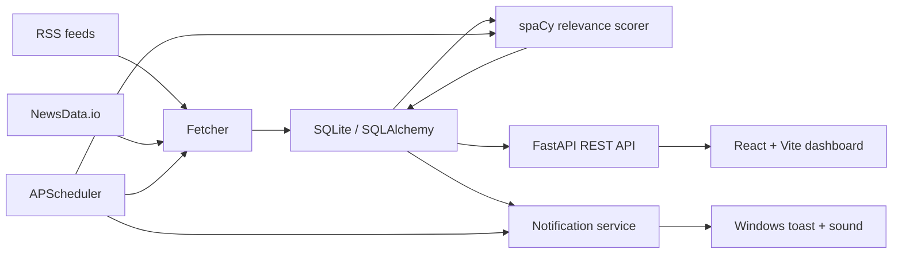

# ⚡ NewsFlash

**Personalised Real-Time News Intelligence System**

NewsFlash is a Windows desktop application that aggregates news from RSS feeds and an optional NewsData.io API, scores articles for personal relevance, stores them locally, and surfaces high-priority stories through a React + Vite dashboard and Windows notifications.

> **Portfolio project:** designed for local use on Windows. It is not a production news service.

[](https://github.com/RoycePlayzz/newsflash/actions/workflows/ci.yml)
[](https://www.python.org/)
[](https://fastapi.tiangolo.com/)
[](https://react.dev/)
[](LICENSE)

## What it demonstrates

- **Automated ingestion:** 15+ configured RSS feeds across 14 categories, plus optional NewsData.io enrichment.
- **Relevance scoring:** transparent 0–10 scoring using category keywords, user-defined keywords, and spaCy named-entity signals.
- **Deduplication:** article URLs are unique in SQLite so repeated stories are not inserted twice.
- **Background processing:** APScheduler runs the fetch → score → notify pipeline on a configurable interval.
- **Desktop notifications:** high-scoring, unnotified articles can trigger Windows toast notifications with sound.
- **Full-stack UI:** React + Vite dashboard with category filters, search, ranking, live updates, and animated visualisations.
- **Local-first storage:** SQLAlchemy ORM over SQLite; the database and secrets stay outside version control.

## Architecture



The core processing loop is:

**Fetch → Clean → Deduplicate → Score → Store → Notify → Display**

See [`docs/ARCHITECTURE.md`](docs/ARCHITECTURE.md) for the design notes and trade-offs.

## Repository layout

```text
newsflash/
├── backend/
│   ├── config.py
│   ├── database.py
│   ├── fetcher.py
│   ├── main.py
│   ├── notifier.py
│   ├── scheduler.py
│   ├── scorer.py
│   └── startup.py
├── frontend/
│   ├── public/
│   └── src/
├── assets/
│   └── alert.wav
├── tests/
├── .env.example
├── requirements.txt
├── start.bat
└── README.md
```

## Development versions

- Python 3.13
- Node.js 22 LTS

These versions match the CI configuration.

## Setup

### Requirements

- Windows
- Python 3.13
- Node.js 22 LTS + npm
- A NewsData.io API key is optional; RSS-only mode works without one.
- spaCy's `en_core_web_sm` model

### 1. Clone

```powershell
git clone https://github.com/RoycePlayzz/newsflash.git
cd newsflash
```

### 2. Backend environment

```powershell
py -3.13 -m venv venv
.\venv\Scripts\Activate.ps1
python -m pip install -r requirements.txt
python -m spacy download en_core_web_sm
```

### 3. Optional API key

Copy `.env.example` to `.env` and set:

```text
NEWSDATA_API_KEY=your_key_here
```

The `.env` file is ignored by Git.

### 4. Frontend

```powershell
cd frontend
npm install
cd ..
```

### 5. Run

```powershell
.\start.bat
```

The launcher opens:

- FastAPI: `http://127.0.0.1:8000`
- API docs: `http://127.0.0.1:8000/docs`
- React + Vite dashboard: `http://localhost:5173`

For manual development:

```powershell
python -m uvicorn backend.main:app --reload
```

and in another terminal:

```powershell
cd frontend
npm run dev
```

## API

| Method | Endpoint | Purpose |
|---|---|---|
| GET | `/health` | Service health check |
| GET | `/articles` | Ranked article feed with optional category filter |
| GET | `/stats` | Article counts by category |
| GET | `/config` | Read user preferences |
| POST | `/config` | Update user preferences |

Interactive API documentation is available at `/docs`.

## Configuration

`user_config.json` controls:

- notification threshold
- polling interval
- enabled categories
- category priorities
- custom keywords
- notification sound

The database is created automatically at `newsflash.db` and is intentionally excluded from Git.

The frontend uses Vite for development and production builds. Create React App is not used.

## Testing

Backend tests run with:

```powershell
python -m pytest -q
```

Frontend production build:

```powershell
cd frontend
npm run build
```

GitHub Actions runs the backend test suite and frontend production build on pushes and pull requests.

## Design notes

### Why RSS + API?

RSS is lightweight and useful for continuously updated feeds. The optional API adds another source when an API key is configured.

### Why SQLite?

NewsFlash is a single-user local desktop application, so SQLite keeps setup simple and eliminates a separate database service.

### Why APScheduler?

The processing loop needs an application-level interval scheduler on Windows. APScheduler runs inside the Python process and keeps the fetch/score/notify cycle together.

### Why a transparent scoring model?

The relevance score is intentionally explainable. It combines category keyword matches, user-defined keyword matches, and a small spaCy entity-recognition signal instead of hiding the ranking behind a black-box model.

## Security

- Secrets belong in `.env`, never in source.
- Runtime database files are ignored.
- No API keys are required to run the RSS-only path.
- `start.bat` and startup registration resolve paths relative to the cloned project instead of relying on a developer-specific filesystem path.

## Future improvements

- Replace frontend polling with WebSockets or Server-Sent Events.
- Add authenticated multi-user profiles.
- Introduce a persistent job queue for higher-volume ingestion.
- Add a learned relevance classifier and offline evaluation set.
- Add richer observability around feed failures and processing latency.

## License

MIT — see [`LICENSE`](LICENSE).
